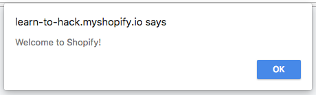

# Cross-site Scripting

### Background:

A cross-site scripting (XSS) vulnerability occurs when text is inserted into an HTML document without having special
characters handled. For example, the following Rails code is vulnerable to cross-site scripting:

```ruby
def bold_my_name(name)
  ("<strong>" + name + "</strong>").html_safe
end
```

If you give this method an input you'd expect like `shopify`, you will get an output like `<strong>shopify</strong>`,
which is what we want (a bolded version of the string `shopify`). But if you think nefariously, there's nothing stopping
the string `name` from containing yet more HTML, or even JavaScript. So if instead of `shopify`, we pass the string
`<script>alert('Welcome to Shopify!')</script>` and you view the resulting HTML in your browser, you'll get the following!



The nice thing about XSS is that the fix is pretty easy. The solution to XSS is
called escaping. Escaping is taking special characters and
turning them into a representation that is safe for the
context. For example, if our above string was escaped
properly for HTML, it would become `&lt;script&gt;alert(&#39;Welcome to Shopify&#39;)&lt;/script&gt;`. As you can see, all the
characters that have special meanings in HTML have been
turned in what HTML calls [entities](https://en.wikipedia.org/wiki/Character_encodings_in_HTML#Character_references). These are representations
that basically say "I didn't mean the special meaning of `>`,
the user wanted to insert a literal `>`".

Let's talk about what that `html_safe` at the end
of our `bold_my_name` method does. In Rails, by default
when strings are inserted into an HTML template, they're
considered to be unsafe and escaped automatically. There
are a couple of ways to tell rails not to do this, for
example instead of using `<%= %>` you can use `<%== %>`
in your templates, or you can use the above mentioned
`html_safe` method to mark a string as HTML and say that
you do not want the text escaped. Similarly, passing a string
into the `raw` method will mark it as HTML. If you
are writing Rails code and using any of these explicit
ways to mark your content as HTML, you should probably
look for a more clear way to state your intent so as to
avoid cross-site scripting vulnerabilities. Move HTML into
templates where possible, or use helpers such as [`tag`](http://api.rubyonrails.org/classes/ActionView/Helpers/TagHelper.html#method-i-tag) and [`safe_join`](http://api.rubyonrails.org/classes/ActionView/Helpers/OutputSafetyHelper.html#method-i-safe_join)
to generate HTML safely.

There's three types of cross-site scripting vulnerability,
reflected, DOM-based XSS, and stored. Reflected XSS is where some
content of the request is returned immediately in the response and
not properly escaped. Stored XSS occurs when input that was earlier
given by the user and stored by the application is later returned in a
response without proper escaping. DOM-based XSS is caused by lack of
escaping when client-side JavaScript is modifying the page.

---
## Try it out!
This app is vulnerable to a DOM-based cross-site scripting
vulnerability.

### Questions:
#### Can you find the vulnerable web page in the app?
<details>
  <summary><b>Hint</b></summary>
  You may want to look at pages where providing input
  without submitting any forms might cause changes on
  the page.
</details>
<details>
  <summary><b>Answer</b></summary>
  The vulnerable page is the product creation page at https://learn-to-hack.myshopify.io/products/new.
</details>


#### Can you identify the vulnerable input?
<details>
  <summary><b>Hint</b></summary>
  Where in this page could you provide some kind of unexpected input like the example above?
</details>

<details>
  <summary><b>Answer</b></summary>
  The vulnerable inputs are the product name, price, and description. This is evident by placing a payload like
  <code><script>alert(1337)</script></code> into either of these boxes
  and seeing the alert pop up.
</details>

#### What is the impact of this kind of bug? Are there common tools that help with exploitation?
<details>
  <summary><b>Hint</b></summary>
If you can get someone to execute one of these payloads,
what could you do? Google around and see what kinds of
things you can do with client side JavaScript.
</details>

<details>
  <summary><b>Answer</b></summary>

  If you can convince a user to execute a cross-site
  scripting payload, you can do a lot of things from stealing cookies to performing
  complex actions as the user, all without their knowledge.
  The tool XSS Hunter (https://xsshunter.com/) allows you to
  do this automatically and collects the following:

  * the vulnerable page's URI
  * origin of execution
  * the victim's IP address
  * the page referer
  * the victim's user agent
  * all cookies without the `HttpOnly` flag
  * the page's full HTML DOM
  * full screenshot of the affected page
  * responsible HTTP request (if an XSS Hunter compatible tool is used)
</details>

### Resources:
- https://www.owasp.org/index.php/Cross-site_Scripting_(XSS)
- https://owasp.org/www-community/xss-filter-evasion-cheatsheet
